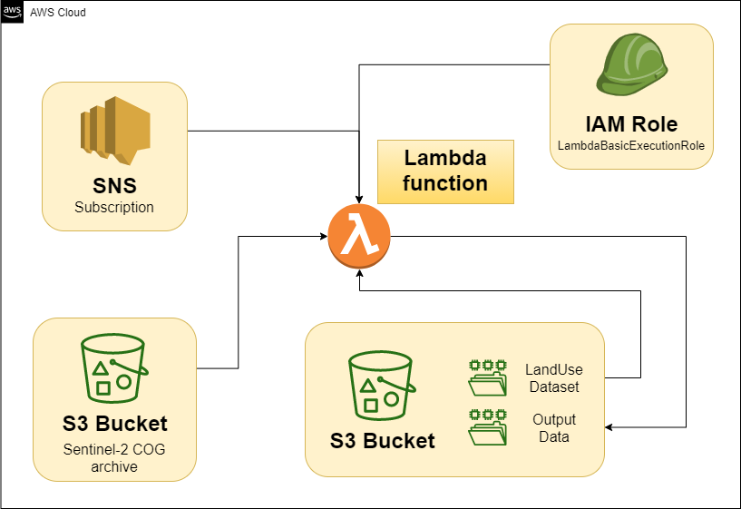

# AWS Lambda SenCloud Monitoring
## Guide of integration between STAC Sentinel-2 and AWS SNS/Lambda

---

This software implements the Python Lambda of the guide [test of integration between STAC Sentinel-2 and AWS SNS/Lambda](https://www.linkedin.com/pulse/how-sunny-my-city-better-process-stac-sentinel2-lambda-alvaro-huarte/).

The guide describes how you can keep up-to-date your own derived data from the Sentinel-2 COG imagery archive using a serverless architecture on AWS.

---

The AWS software architecture used consists of:

+ An IAM role to define the access policy of the AWS Lambda function.
+ A subscription to the SNS topic that notifies new STAC products, paying attention to Sentinel-2 COG products.
+ A S3 Bucket to host one input LandUse layer, and for saving output data.
+ A Lambda function that reads Sentinel-2 masks from the Sentinel-2 COG bucket and merge them with the LandUse layer using numpy.
